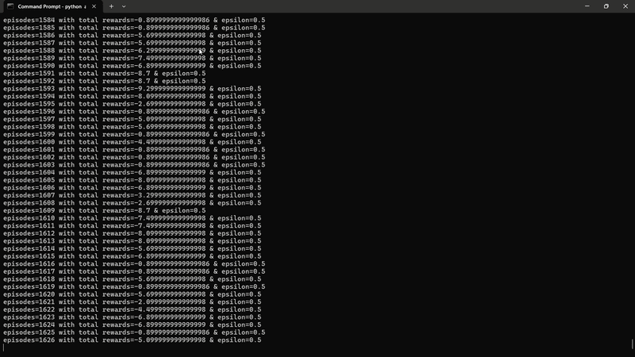

<p align="center">
  <a href="https://git.io/typing-svg">
        </a>
</p>

<p align="center">
  
  
  
  
</p>

---

> **Project Overview:** A sleek and efficient implementation of a Reinforcement Learning agent trained to master the classic Flappy Bird game. Watch the agent seamlessly transition from chaotic, random actions to highly precise maneuvering by optimizing its policy trajectories over successive training epochs.

---

## 📺 Training & Testing Showcase

<table border="0" width="100%">
  <tr>
    <td align="center" width="50%">
      <h3>🏋️‍♂️ Training Phase</h3>
      
    </td>
    <td align="center" width="50%">
      <h3>🎮 Evaluation/Testing</h3>
      
    </td>
  </tr>
</table>

---

## 🛠️ Tech Stack & Core Dependencies

Built from scratch using Python ecosystems designed specifically for physical simulations, optimal state discretizations, and numerical pipeline control:

* **🎮 Game Framework:** `pygame` — Orchestrates a custom, lightweight rendering loop tracking continuous box collisions and obstacle physics.
* **🔢 Matrix Operations:** `numpy` — Controls high-speed state discretization, dynamic Q-table updates, and multi-dimensional reward matrices.
* **🧠 RL Backbone:** `torch` & `gymnasium` — Powers the Deep Q-Network structures, target step alignment, and standard model-environment wrappers.
* **⚙️ Configurations:** `yaml` — Externalizes game environment variables, learning rates, and exploration decay parameters.
* **📁 Architecture Controls:** `os` — Controls local runtime saving directory maps, model architecture checkpoint pipelines, and dynamic exports.
* **🔂 Loop Utilities:** `itertools` — Generates ultra-efficient mathematical iterations for infinite environment loop stepping.
* **🎲 Stochastic Engines:** `random` — Handles randomized environment seeding alongside balancing the $\epsilon$-greedy exploration rate scheduling.

---

## 🧠 Algorithmic Mechanics

* **State Spaces:** The avian agent reads structural coordinates relative to its target (e.g., horizontal/vertical delta spaces to the next pipeline gap, coupled with localized vertical velocities).
* **Action Boundaries:** The agent calculates the highest expected reward value between a simple binary action space: `Action 0` (Idle Fall) or `Action 1` (Flap).
* **Reward Shapping:** Continuous execution tracks standard survivability factors (`+x` per step), penalizes catastrophic wall/pipe crashes intensely, and awards high-tier breakthrough weight configurations upon passing goal checkpoints safely.

---

## 🚀 Execution Guide

Get the project up and running inside your local terminal environment instantly:

### Installation
```bash
git clone [https://github.com/mkdirharsh108/FlappyBird-RL.git](https://github.com/mkdirharsh108/FlappyBird-RL.git)
cd FlappyBird-RL
```

### Training
```bash
python agent.py flappybirdv0 --train
```

### Testing
```bash
python agent.py flappybirdv0
```
